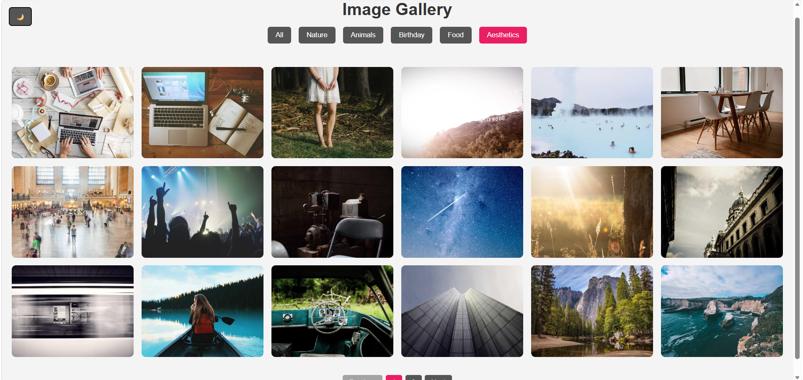
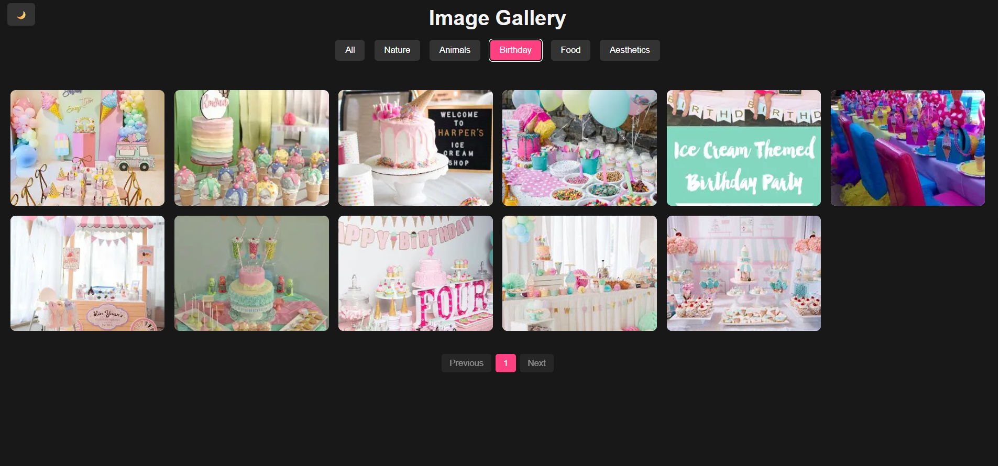

# 🖼️ Image Gallery

A responsive, feature-rich image gallery web app with category filtering, dark mode, lightbox viewer, zoom support, and favorites — built with pure HTML, CSS, and JavaScript.

---

## ✨ Features

- **Category Filtering** — Browse images by All, Nature, Animals, Birthday, Food, and Aesthetics
- **Dark / Light Mode** — Toggle between themes with one click
- **Lightbox Viewer** — Click any image to open a full-screen view
- **Zoom Support** — Scroll to zoom in/out; drag to pan when zoomed; pinch-to-zoom on mobile
- **Keyboard Navigation** — Use arrow keys to navigate, Escape to close lightbox
- **Favorites System** — Like images to save them; a dynamic Favorites tab appears automatically
- **Image Download** — Download any image directly from the lightbox
- **Pagination** — Images are paginated (18 per page) for better performance
- **Lazy Loading** — Images load only when needed for faster performance
- **Fully Responsive** — Works on all screen sizes

---

## 🛠️ Built With

- HTML5
- CSS3 (Custom Properties, CSS Grid, Transitions)
- Vanilla JavaScript (DOM Manipulation, Fetch API, Touch Events)

---

## 📁 Project Structure

```
Image_Gallery/
├── index.html
├── style.css
├── script.js
└── assets/
    ├── aesthetics.jpg
    ├── nature1.jpg
    ├── b1.webp ... b11.jpg   (Birthday images)
    ├── h1.jpg ... h4.jpg     (Food images)
    ├── i1.webp ... i5.webp   (Food images)
    ├── m1.jpg                (Animal image)
    ├── n1.jpg                (Food image)
    └── p1.jpg ... p3.jpg     (Food images)
```

---

## 🚀 How to Run Locally

1. Clone the repository:
   ```bash
   git clone https://github.com/Rabia-1275/image-gallery.git
   ```

2. Open the project folder:
   ```bash
   cd image-gallery
   ```

3. Open `index.html` in your browser — no installation needed.

---

## 🌐 Live Demo

> 🔗 [View Live Project](#) *(https://rabia-1275.github.io/Image-Gallery/)*

---

## 📸 Screenshots

| Light Mode | 



| Dark Mode | 



---

## 🎯 What I Learned

- Building dynamic filtering systems with JavaScript
- Implementing a custom lightbox from scratch without any library
- Adding pinch-to-zoom and drag functionality using Touch and Mouse events
- Managing pagination logic manually
- Using CSS custom properties for theme switching

---

## 👩‍💻 Author

** Rabia Naseer **
- GitHub: [@Rabia-1275](https://github.com/Rabia-1275)
- LinkedIn: [Rabia Naseer](https://www.linkedin.com/in/rabia-naseer-33421a307)

---